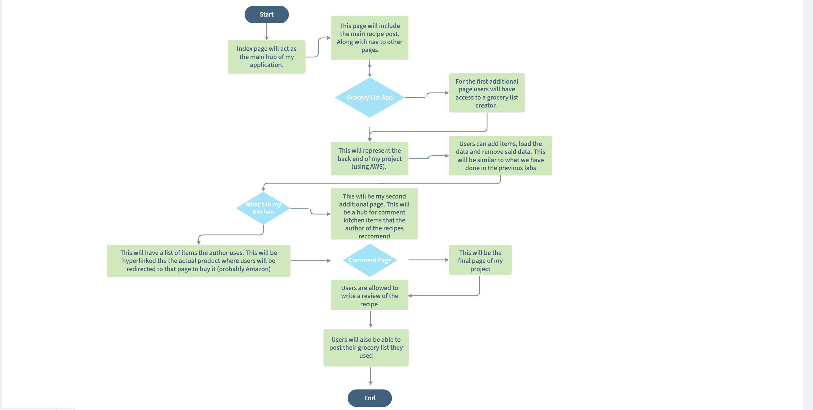

# Final Project Specs

## Project Spec

For my project, I intend to create an application related to food and recipes. I plan to have the main page be a blog-type layout where the owner of the application posts recent recipes they have tried. This will include the actual recipe, time requirement, and difficulty level. Off of this main page will be a grocery list application, which will have similar functionality to our recent project with AWS. The user can add food items they need, load the data, and check off items they bought. I will have a separate page acting either as a comment section so users can post their experiences with the recipes or as a photo gallery of sorts. I am unsure which approach I will take at this moment, but I am leaning more toward the comment section, that way in one of the posts users can share the grocery lists they created as a way of "tweaking" the original recipe that the main homepage will share. In this way, I can retrieve data and display it on a separate page to meet the requirements of B-. For the final page, I think it would be interesting to add a "what's in my kitchen" section with links for users to buy items the author uses.

What is the general theme: This will be a food-based application where users can learn new recipes and share their experiences cooking them with other users in the comment section. The application is a one-stop shop with a built-in grocery list application, making it easy for the user to look at the recipe and add items they need. I often find new recipes all the time and forget what I need to buy, so I believe this feature will be very convenient and meet the backend requirements of this assignment. Finally, ending the general theme of cooking/food, I plan to have an additional page of items users can buy. This will be similar to users clicking an image and having it sent to Amazon or another online shop.

What is it going to do: I think the main goal of the page is to prompt new cooking experiences in a convenient way. Users can track what they need to purchase and items they could potentially try in the kitchen, along with building a sense of community in the cooking realm.

Who is the target audience: This will be focused on the general public and cooking enthusiasts. Often, I go online to look for a recipe, so I wanted to combine my favorites into one concrete place.

What sort of data will it manage: User comments will be managed. I think I'll have some fake comments hardcoded and then give the option for users to add their own. Along with this, the grocery list backend will involve adding food items, loading the list, and deleting them.

Stretch Goals: I personally just want all the pages to be aesthetic looking and flow togther. I think I can manage all the functions, but making it look good will be my main goal. I think I can take a lot of the previous projects we have done and alter them to meet my project expectations. But incorporating everything together and making it look good will require a lot of time. This seems like a challenging application, but it relates to something I enjoy doing (cooking new recipes).

## Project Wireframe

